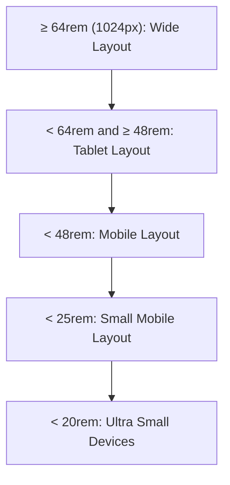
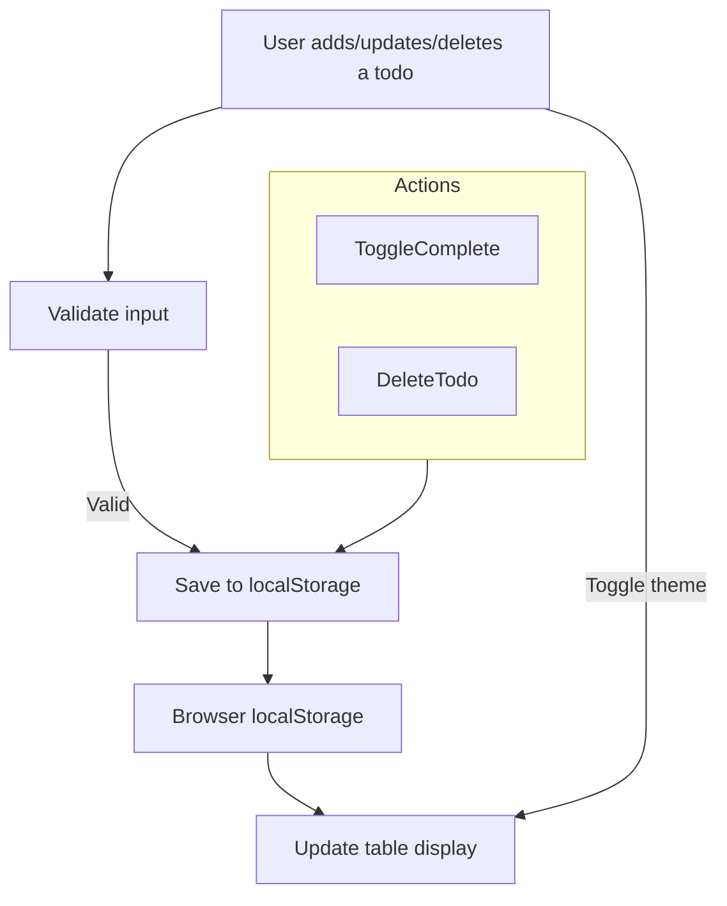
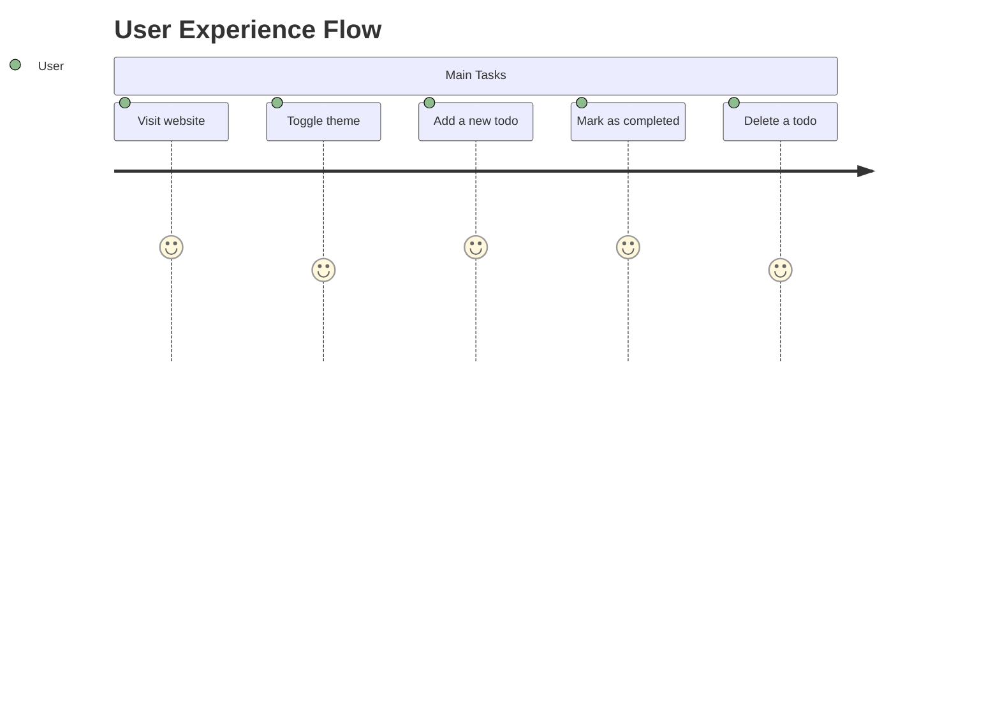

# TODO List Application Documentation

This documentation provides a complete overview of the TODO List web application, which allows users to manage their daily tasks. The application is responsive, features a dark/light theme toggle, and persists data using the browser's local storage.

**Demo URL:** [https://todolist-website-ruby.vercel.app/](https://todolist-website-ruby.vercel.app/)

---

## Overview

The TODO List app is a simple and modern web application for managing tasks. Users can:

- Add new todos with a name and description.
- Mark todos as completed.
- Delete todos.
- Switch between dark and light themes.
- Enjoy a fully responsive design for all device sizes.
- Data persists even after refreshing the browser.

---

# index.html

This file is the main structure and style of the TODO List app. It contains the HTML markup, links to styles and scripts, and declares the app’s layout and UI.

## Key Sections

- **Header (`<nav>`)**: Displays the app logo and the theme toggle button.
- **Form**: Allows users to add new todo items.
- **Todo Table**: Lists all current todos with options to mark as completed or delete.

### HTML Structure Highlights

```html
<nav class="navbar">
  <div class="logo">
    <i class="fas fa-check"></i>TODO LIST
  </div>
  <button class="icon-btn theme-toggle-btn" id="theme-toggle-button" title="Toggle Theme">
    <i class="fa-solid fa-moon"></i>
  </button>
</nav>
<!-- Main container -->
<div class="container">
  <h1 id='todo-title'>TODOs List</h1>
  <div class="form-container">
    ...
    <button type="submit" id="todo-button">Add Todo</button>
  </div>
  <h1 id="todo-title2">Your TODOs</h1>
  <div class="table-container">
    <table>
      <thead>
        <tr>
          <th class="sno">S.NO</th>
          <th class="todo-name">Todo Name</th>
          <th class="todo-description">Todo Description</th>
          <th class="todo-checkbox">Completed</th>
          <th class="todo-delete">Delete Todo</th>
        </tr>
      </thead>
    </table>
  </div>
</div>
```

---

## Styling & Responsiveness

The app uses **CSS custom properties** for easy theming and is styled for a modern look. There are multiple media queries to ensure the UI adapts to all screen sizes, including mobile devices.

### Main Style Features

- **Dark/Light Mode**: Controlled by toggling the `dark-mode` class on `<body>`.
- **Responsive Layout**: Media queries adjust padding, font sizes, and component positions for tablets and mobile screens.
- **Modern Components**: Cards, shadows, gradient backgrounds, and interactive button styles.

---

### Responsive Layout Diagram

Below is a flowchart illustrating how the app adapts to different device widths:



---

# script.js

This file provides all interactive functionality for the TODO List app using vanilla JavaScript.

## Main Functionalities

- **Theme Toggle**: Switches between dark and light themes.
- **Add Todo**: Adds a new todo to local storage and updates the UI.
- **Display Todos**: Renders the list of todos in a table.
- **Mark as Completed**: Sets a todo as completed or uncompleted.
- **Delete Todo**: Removes a todo from the list.
- **Persistence**: Saves and loads todos from `localStorage`.

---

## Core Functions Explained

### Theme Toggle

When the user clicks the theme toggle button, the app switches themes and updates the icon.

```js
function toggleTheme() {
  const body = document.body;
  const themeButton = document.getElementById('theme-toggle-button');
  const isDarkMode = body.classList.toggle('dark-mode');
  themeButton.innerHTML = `<i class="fa-solid fa-${isDarkMode ? 'sun' : 'moon'}"></i>`;
}
```

**Default Mode:** Dark mode is enabled on first load.

---

### Add Todo

Handles form submission, validates inputs, and saves the todo.

```js
function addTodo() {
  const name = todoname.value.trim();
  const description = tododescription.value.trim();
  if (name === '' || description === '') {
    alert('Please fill in both fields!');
    return;
  }
  const todo = {
    id: Date.now(),
    name: name,
    description: description,
    completed: false
  };
  saveTodoToLocalStorage(todo);
  todoname.value = '';
  tododescription.value = '';
  displayTodos();
}
```

---

### Local Storage Operations

#### Save

```js
function saveTodoToLocalStorage(todo) {
  let todos = getTodosFromLocalStorage();
  todos.push(todo);
  localStorage.setItem('todos', JSON.stringify(todos));
}
```

#### Load

```js
function getTodosFromLocalStorage() {
  const todos = localStorage.getItem('todos');
  return todos === null ? [] : JSON.parse(todos);
}
```

---

### Display Todos

Renders all todos in a table, with the ability to check/uncheck and delete.

```js
function displayTodos() {
  const todos = getTodosFromLocalStorage();
  // ...rebuilds table rows dynamically
}
```

---

### Mark as Completed & Delete

Mark as completed:

```js
function toggleComplete(id) {
  let todos = getTodosFromLocalStorage();
  todos = todos.map(todo => {
    if (todo.id === id) {
      todo.completed = !todo.completed;
    }
    return todo;
  });
  localStorage.setItem('todos', JSON.stringify(todos));
  displayTodos();
}
```

Delete:

```js
function deleteTodo(id) {
  let todos = getTodosFromLocalStorage();
  todos = todos.filter(todo => todo.id !== id);
  localStorage.setItem('todos', JSON.stringify(todos));
  displayTodos();
}
```

---

## Data Flow Diagram

The following diagram shows the process flow from user actions to UI update:



---

## Table Layout

**Table Columns:**

| Column         | Description            |
| -------------- | --------------------- |
| S.NO           | Serial number         |
| Todo Name      | Name of the todo      |
| Todo Description | Description        |
| Completed      | Checkbox to toggle    |
| Delete Todo    | Button to remove      |

---

# Responsiveness

The application is designed to look great and function smoothly across all screen sizes.

- **Desktop**: Wide, centered form and table.
- **Tablet**: Adjusted widths and font sizes.
- **Mobile**: Stacked layout, table rows displayed as cards.
- **Tiny Devices**: Further reduction in padding and font sizes.

---

# Data Persistence

All todos are stored in the browser's `localStorage`, so data remains even after the browser is closed or refreshed.

---

# User Journey

Below is a representation of the typical user journey when using the TODO List application.



---

# README

```markdown
# TODO List Web Application

A simple and modern TODO List app to help you manage your daily tasks.

- **Live demo:** [https://todolist-website-ruby.vercel.app/](https://todolist-website-ruby.vercel.app/)

## Features

- Add new todos with name and description.
- Mark tasks as completed.
- Delete tasks you no longer need.
- Toggle between elegant dark and light themes.
- Responsive UI for desktop, tablet, and mobile.
- Persistent data using browser localStorage.

## Usage

1. Visit the [live site](https://todolist-website-ruby.vercel.app/).
2. Add your todos via the form.
3. Check completed items or delete them as needed.
4. Switch themes using the top-right button.
5. Enjoy seamless use on any device!

## Technologies

- HTML, CSS (with responsive design & themes)
- JavaScript (localStorage for persistence)
- FontAwesome (icons)
- Google Fonts (Orbitron)

---

> This is a frontend-only, privacy-friendly TODO app. Your data never leaves your browser!
```

---

```card
{
    "title": "Mobile Friendly",
    "content": "This TODO List app is fully responsive and works beautifully on all screen sizes."
}
```

---

```card
{
    "title": "Persistence",
    "content": "All your tasks are saved in your browser, so you never lose your todos."
}
```

---

# Conclusion

The TODO List web application is a robust and stylish tool for daily productivity. Its responsive design, persistent storage, and modern interface make it an excellent choice for personal task management. Try it out at [https://todolist-website-ruby.vercel.app/](https://todolist-website-ruby.vercel.app/)!
